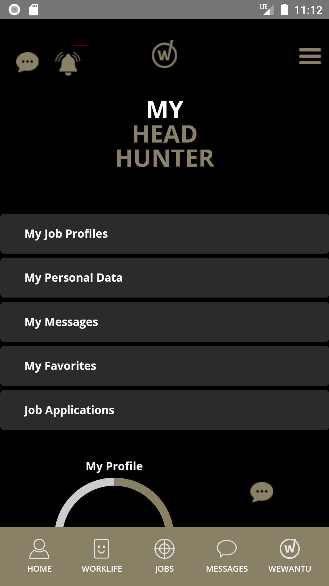
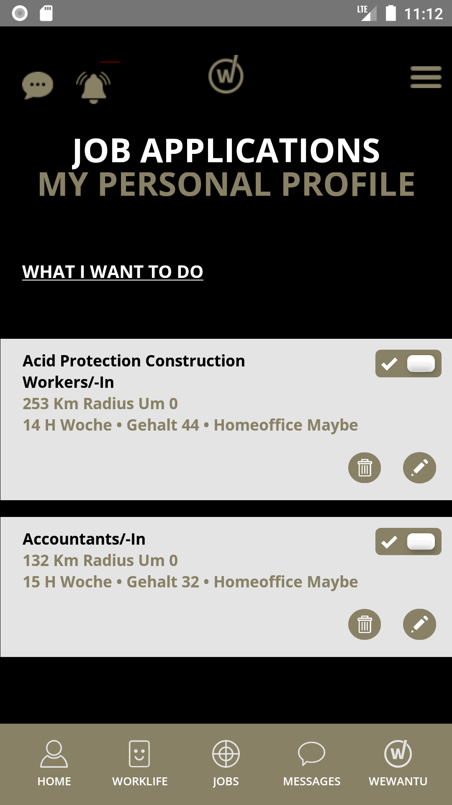
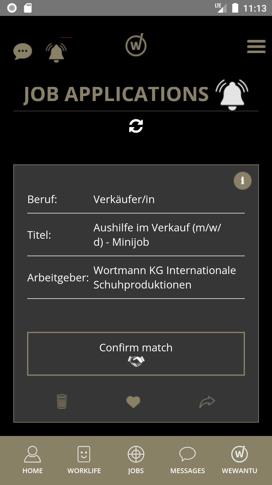
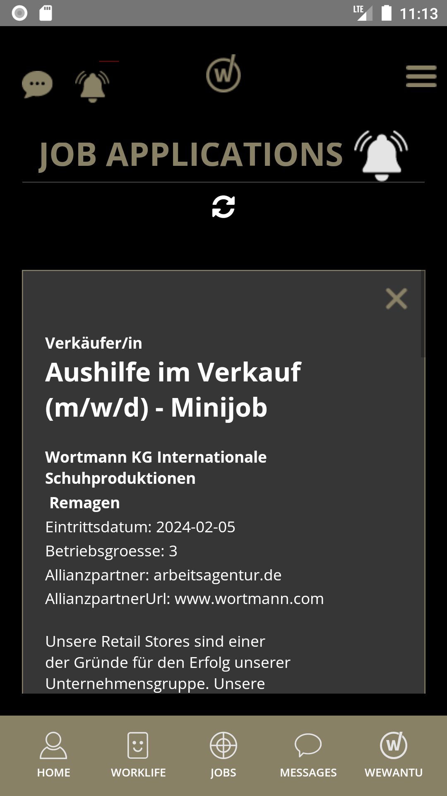
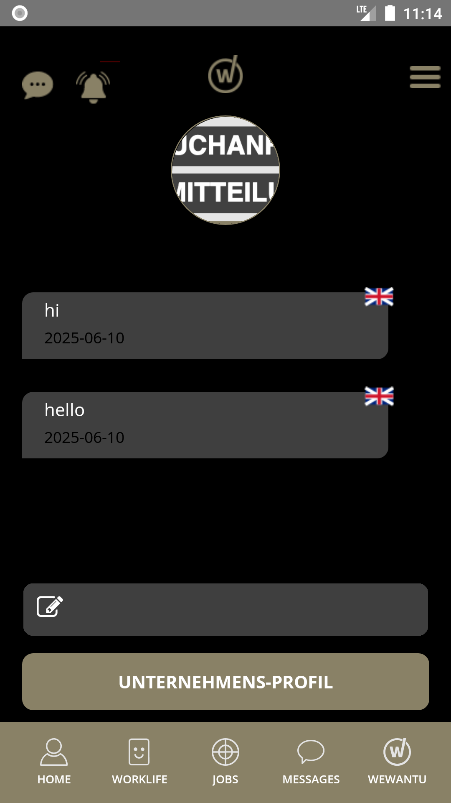
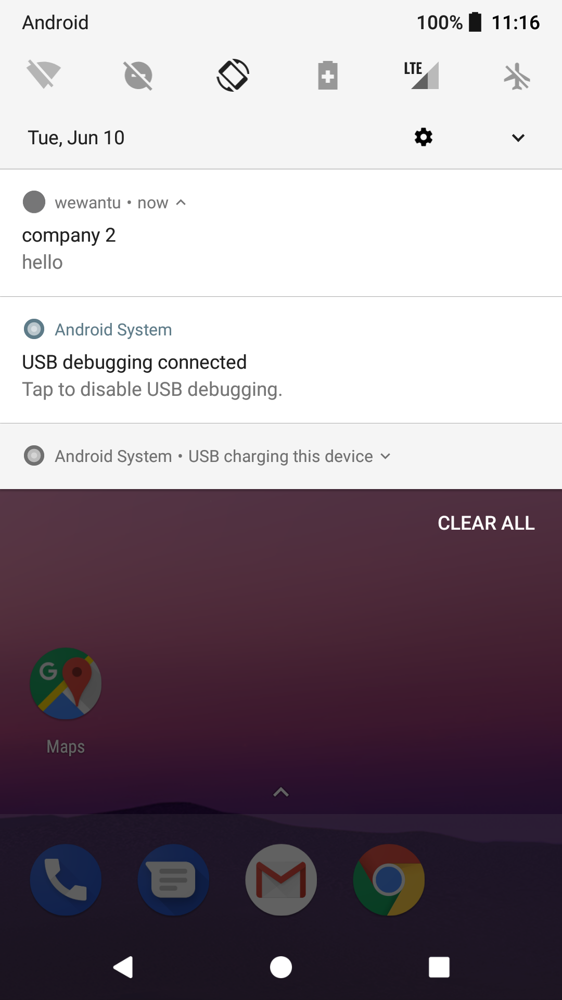
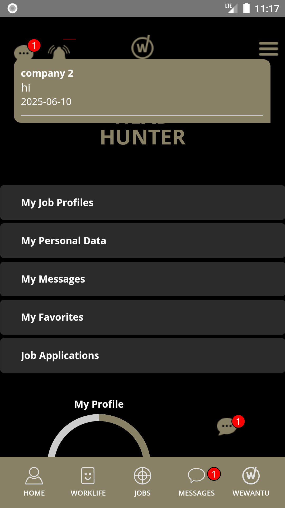
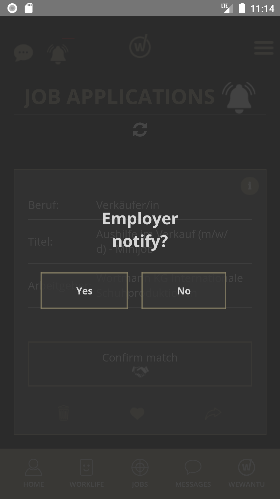

# Job Connect – React Native App

A mobile application built with **React Native** that connects **job seekers** with **employers** . The platform facilitates real-time communication and job posting, making it easy for employers and candidates to connect on the go.

---

## 🚀 Features

### 🏙️ Local Job Marketplace
- Focused exclusively on Germany to ensure high-relevance job matches.

### 👤 Employer Registration
- Employers can **register and log in** to create their profiles.
- Ability to **post job listings** with detailed job descriptions and requirements.

### 💬 Real-time Chat
- Seamless **real-time messaging** between job seekers and employers.
- Powered by **Firebase Realtime Database** or **Firestore**.

### 🔔 Push Notifications
- Receive **push notifications** from the website or backend server using **Firebase Cloud Messaging (FCM)**.
- Alerts for new messages, job application status, and more.

### How does it feel
- Talk about each person's work feelings according to each month of the year

### 📱 Responsive Mobile Design
- Fully **responsive UI** optimized for all modern mobile screen sizes.
- Ensures a smooth and intuitive user experience across devices.

---

## 🛠️ Tech Stack

- **React Native** (with Expo or CLI)
- **Firebase Authentication** – User login and registration
- **Firebase Firestore** or **Realtime Database** – Chat functionality
- **Firebase Cloud Messaging** – Push notifications
- **React Navigation** – Navigation between screens
- **React Viewpager** – Swipe between screens
- **Styled Components / Tailwind / CSS-in-JS** – UI styling (choose as preferred)

---

📸 Screenshots
| Page | Description |
|------|-------------|
|  | ** Homepage **
|  | ** Job Profile Page ** |
|  | ** List of Job Page** |
|  | ** Job Detail Page** |
|  | ** Chat page by Real time Firebase ** |
|  | ** Notification Page ** |
|  | ** Notification Page ** |
|  | ** Job Detail Page** |
|  | ** How user feel Page ** |


## 📦 Installation

```bash
git clone https://github.com/vunamweb/wewantu.git
cd frankfurt-job-connect
npm install
npx react-native run-android  # or run-ios
